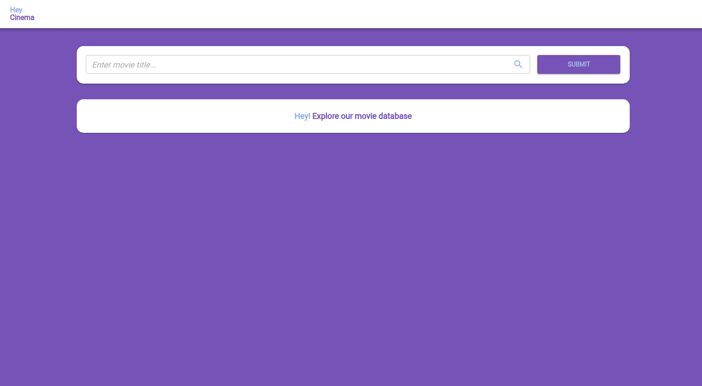
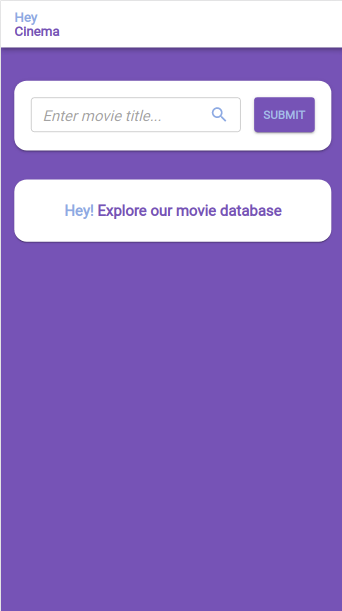
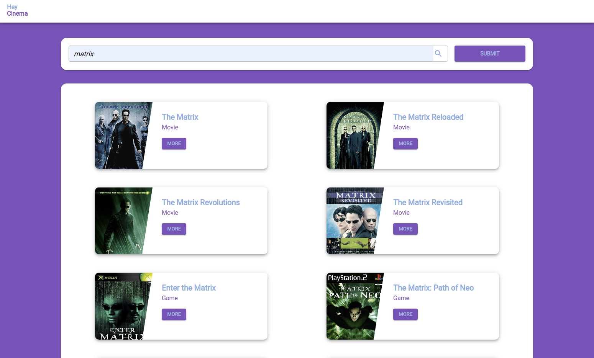
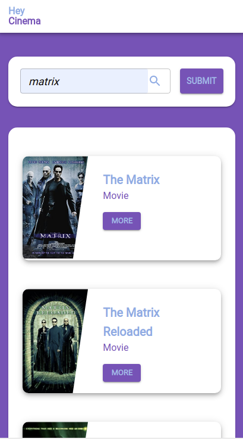
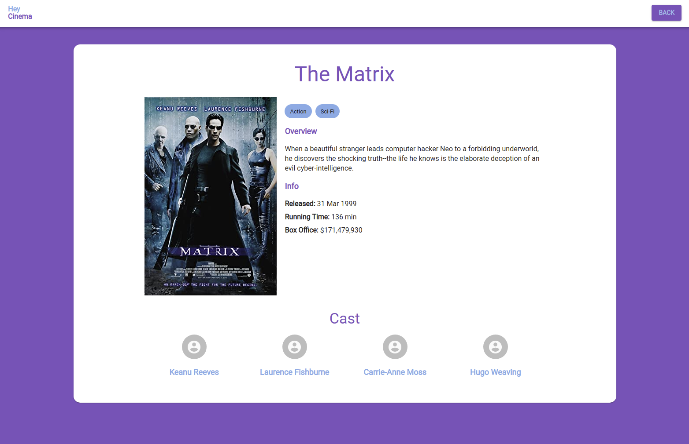
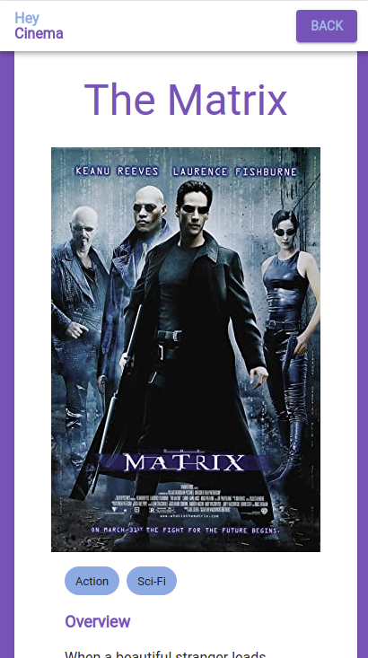

# OMDB React App

This project was bootstrapped with [Create React App](https://github.com/facebook/create-react-app).

## Live Hosted Version

[Live Version](https://omdb-react-app.web.app/movies)

## Application Commands

#### Local Environment

- **START** `yarn start` - Used to start development server
- **BUILD** `yarn build` - Bundle and package production build

## Application Choices

#### UI Choices

- Instead of importing components directly from a 3rd party library, I like to create my own 'component library' and create a wrapper around the components
  - This is to aid with ease of refactoring in future, if ever a UI Component library was to change, it would only be in one place
- Atomic Design Principles of breaking down components into their smallest structure, and combining them to create other components

## Screen Shots

#### List View Desktop

#### List View Mobile

#### List View Results Desktop

#### List View Results Mobile

#### Detail View Results Desktop

#### Detail View Results Mobile

#### Not Found

